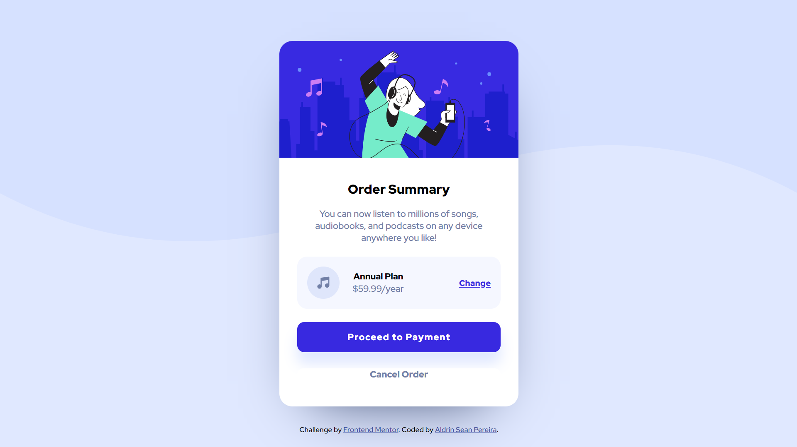

# Frontend Mentor - Order summary card solution

This is a solution to the [Order summary card challenge on Frontend Mentor](https://www.frontendmentor.io/challenges/order-summary-component-QlPmajDUj). Frontend Mentor challenges help you improve your coding skills by building realistic projects. 

## Table of contents

- [Overview](#overview)
  - [The challenge](#the-challenge)
  - [Screenshot](#screenshot)
  - [Links](#links)
- [My process](#my-process)
  - [Built with](#built-with)
  - [What I learned](#what-i-learned)
  - [Continued development](#continued-development)
  - [Useful resources](#useful-resources)
- [Author](#author)
- [Acknowledgments](#acknowledgments)

## Overview

### The challenge

Users should be able to:

- See hover states for interactive elements

### Screenshot



### Links

- Solution URL: [link](https://github.com/AldrinSeanPereira/order-summary-component-main)
- Live Site URL: [link](https://silver-pithivier-5d1799.netlify.app/)

## My process

### Built with

- Semantic HTML5 markup
- CSS custom properties
- Flexbox
- Mobile-first workflow

### What I learned

The biggest problem I faced in this project was how to structure the music icon, price and change link so it fits in a responsive design

Some new concepts I learned were on how to use properties for background images (background-image, background-size, background-repeat)

I had to constantly put the code on GitHub to see how the code worked on my mobile too.

---
NOTE: <br>
The problem can be solved better by using CSS Grid instead of the combination of CSS Flexbox and HTML in this project.

I will use Grid in future practice projects
<br>

---
<br>
I had to spend a lot more time on these code snippets: 

- for the HTML, the problem was whether I should add class names like `subcontainer` and `subcontainer-subcontainer` to the divs inside `annual-plan` 
<br>
<br>

```html
<div class="annual-plan">
      <div>
        
        <div>
          <h5 class="annual-plan-text">Annual Plan</h5>
          <p class="annual-plan-price">$59.99/year</p>
        </div>
      </div>
      <a href="" class="annual-plan-change">Change</a>
    </div>
```
<br>

  - for the CSS, I finally went with `.annual-plan div` method of applying CSS which is easier to read
  - the box shadow part was a trial-and-error method of finding what worked and it was tough. 

```css
body,
main,
.annual-plan,
.annual-plan div,
.annual-plan div div {
    display: flex;
}

.button-proceed {
    box-shadow:  0 18px 20px 0px var(--primary-pale-blue);
}
```

### Continued development

The projects I make in future will use CSS Grid layout which I am very eager to implement so I can improve my skill in using it.

### Useful resources

- [background-image resource link](https://developer.mozilla.org/en-US/docs/Web/CSS/background-image) 
- [background-size resource link](https://developer.mozilla.org/en-US/docs/Web/CSS/background-size)
    - contain 
      - the element will **contain the image** in the background without stretching or cutting up overflowing parts (cropping). 
      - So it **wont fill the entire background** of the element but only a part depending on image size
    - cover 
      - the image **will cover the entire background** of the element

- [background-repeat resource link](https://developer.mozilla.org/en-US/docs/Web/CSS/background-repeat)


## Author

- LinkedIn - [Aldrin Sean Pereira](https://www.linkedin.com/in/aldrinseanpereira/)
- Frontend Mentor - [@AldrinSeanPereira](https://www.frontendmentor.io/profile/yourusername)
- GitHub - [@AldrinSeanPereira](https://www.frontendmentor.io/profile/AldrinSeanPereira)

## Acknowledgments

My sincere thanks to Frontend Mentor and the help section of their discord server.
